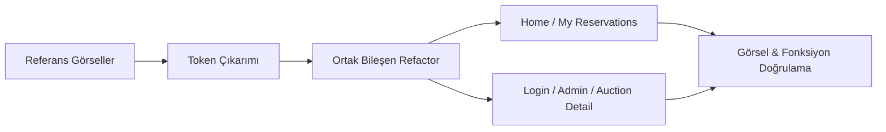

# Sistem Mimarisi (System Patterns)

## Mimari Genel Bakış
HotHour, backend’de API-first iş mantığına sahip olup frontend katmanında Vue 3 + Pinia + Tailwind ile çalışan bir SPA’dır. Bu yeniden plan ile mimarinin backend tarafı korunur; değişim frontend sunum mimarisinde yapılır.

## Yeni Mimari Karar: Referans Tabanlı Sunum Katmanı

### 1) Canonical Reference Pattern
- Tek görsel gerçeklik kaynağı: `Referans Görseller/`
- Mevcut canonical ekranlar:
  - `HomeView.html/.png`
  - `MyReservationsView.html/.png`
- Diğer tüm ekranlar bu iki kaynaktan türetilen design tokens + layout pattern ile üretilir.

### 2) UI Tokenization Pattern
Referanslardan çıkarılacak çekirdek token grupları:
- Renk paleti: koyu arka plan, neon primary/secondary vurgular
- Tipografi: display + mono kullanım senaryoları
- Radius/Shadow/Glow: kart, buton ve durum etiketlerinde ortak standart
- Durum renkleri: live, confirmed, completed, warning/turbo

### 3) Component-Driven Refactor
Ortak görsel öğeler reusable component’lere taşınır:
- Üst navigasyon/topbar
- Glass card ve section wrapper
- CTA buton varyantları
- Durum rozetleri
- Kod/etiket blokları (rezervasyon kodu vb.)

### 4) Screen Mapping Strategy
- **Direct Reference:** Home, My Reservations
- **Derived Reference:** Login, Auction Detail, Admin Dashboard, Admin Create, Admin Reservations

Derived ekranlar, yeni işlev eklemeden sadece referans görsel diline uyarlanır.

### 5) Functional Isolation Rule
- Store, API servisleri ve router iş mantığı korunur.
- UI refactor sırasında domain logic’e müdahale edilmez.
- Hata/empty/loading durumları görsel olarak yeniden tasarlanır fakat davranış değiştirilmez.

### 6) Real-time Visual Contract
- `price_update`, `turbo_triggered`, `auction_booked`, `booking_confirmed` eventleri mevcut şekilde kalır.
- Bu eventlerin UI karşılıkları referans diline uyarlanır (renk, glow, badge, animasyon yoğunluğu).

## Akış Diyagramı (UI Refactor)

## Mimari Sınırlar
- Backend endpointleri, veritabanı şeması ve servis kuralları bu fazda değişmeyecek.
- Yeniden tasarım fazı, yalnızca frontend görsel katman + component kompozisyonu kapsamındadır.

## Backend Patterns (Faz R3 Update)

### Auth ve Kullanıcı Yönetimi
- **JWT (Stateless):** Access token `Authorization: Bearer` header ile taşınır.
- **Pydantic & Prisma:** 
  - Request: `UserCreate`, `UserLogin` (Strict Validation)
  - Response: `Token`, `UserResponse`
  - DB: Prisma user tablosu ile tam uyumlu mapping.
- **Email Verification:**
  - Akış: `POST /register` -> Background Task (Send Mail) -> `GET /verify-email`.
  - Token: Özel `type='verification'` claim'li JWT.
  - State: `user.isVerified` varsayılan `False`.

### Rezervasyon Yetki ve Yarış Koşulu (Race) Pattern
- **Backend Authority:** Rezervasyon kabul/red kararı backend service katmanında verilir.
- **Unique Constraint Lock:** `reservation.auctionId` tekil kısıtı ile aynı oturuma tek rezervasyon garantilenir.
- **Conflict Contract:** Yarış kaybeden kullanıcı `409 Conflict` alır.
- **Role Gate:** `ADMIN` rolü için rezervasyon işlemi service-level kural ile engellenir (`403`).

### Frontend Çok Katmanlı Guard Pattern
- **UI Guard:** `AuctionCard` ve `AuctionDetail` CTA disable kuralları (status + role + eligibility).
- **Store Guard:** `auctionStore.bookAuction` içinde merkezi rol kontrolü.
- **Server Guard:** Frontend koruması atlatılsa dahi backend nihai engeli uygular.

### Realtime Disable/State Sync Pattern
- **Room Scope:** `auction:{id}` odasına yayın.
- **`auction_booked` Event:** Tüm izleyicilerde status anında `SOLD` olur; CTA dinamik kullanım dışı kalır.
- **`turbo_triggered` Event:** Tüm izleyicilerde `turboStartedAt` state’i canlı güncellenir.

### Turbo Senkronizasyon Pattern
- Turbo tetikleme sadece manuel endpoint’e bırakılmaz.
- Listeleme/detay/periyodik kontrol akışında `ensure_turbo_triggered` adımı çalışır.
- Böylece backend state (`turboStartedAt`) ve frontend görünümü tutarlı kalır.

### DB Engine Dayanıklılık Pattern
- `list_auctions` çağrısında transient Prisma engine bağlantı kopmalarında:
  1) hata yakalama,
  2) `connect_db()` ile reconnect,
  3) tek sefer retry
  uygulanır.
