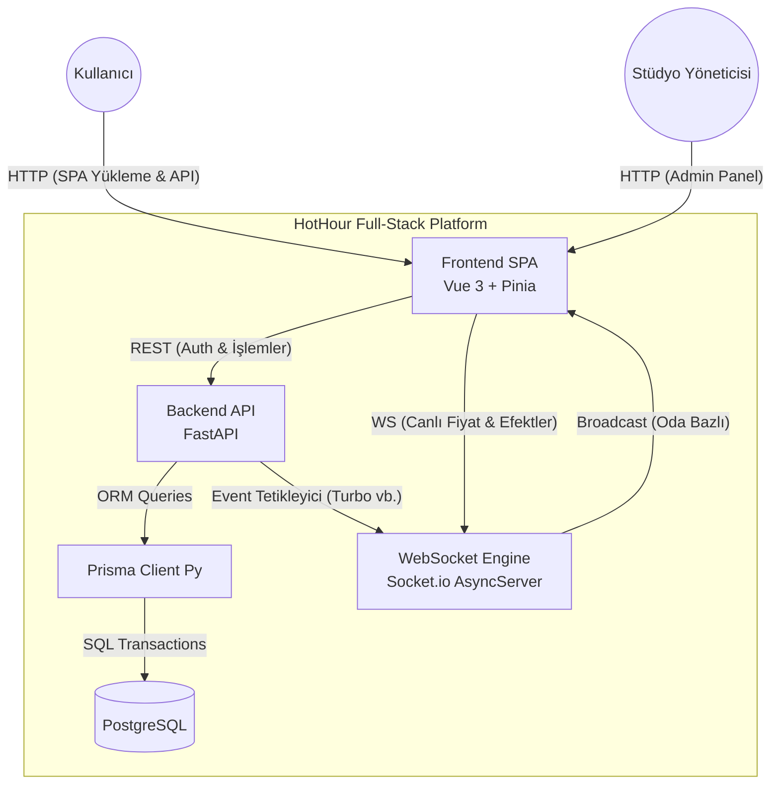

# Sistem Mimarisi (System Patterns)

## Mimari Genel Bakış
Sistem, modern bir **Micro-SaaS** mimarisi izlemektedir. Uygulama, "API-First" prensibiyle tasarlanmış olup; yüksek performanslı bir Python/FastAPI backend, gerçek zamanlı iletişim için Socket.io ve reaktif bir Vue 3 / Tailwind CSS frontend barındırır. Veri bütünlüğü ve işlemlerin güvenliği PostgreSQL üzerinde Prisma ORM ile sağlanır.

### Diyagram


## Temel Tasarım Desenleri

### 1. API-First ve Ayrık (Decoupled) Mimari

* Tüm iş mantığı, doğrulama (validation) ve veritabanı işlemleri FastAPI endpoint'leri üzerinden izole bir şekilde sunulur.
* Frontend (Vue 3), veriyi yönetmekten ziyade API ve WebSocket üzerinden gelen state'i (durumu) tüketip görselleştiren bir sunum katmanıdır.

### 2. Olay Güdümlü Gerçek Zamanlı Motor (Event-Driven Real-time)

* Backend tarafında fiyat hesaplamaları "On-Demand" (istek anında) veya admin tetiklemeleriyle hesaplanır. Ekstra bir background worker (Celery vb.) karmaşasından kaçınılmıştır.
* `socketio.AsyncServer` kullanılarak "Oda (Room)" tabanlı bir yayın mimarisi kurulmuştur:
* **`auction:{id}` Odası:** İlgili seansın fiyat güncellemeleri (`price_update`) ve turbo mod bildirimlerini (`turbo_triggered`, `auction_booked`) dinler.
* **`user:{id}` Odası:** Sadece o kullanıcıya özel rezervasyon onayları (`booking_confirmed`) iletilir.


### 3. Yarış Durumu (Race Condition) ve İşlem Bütünlüğü

* "Hemen Kap" senaryosunda aynı milisaniyede gelen istekleri yönetmek için veritabanı seviyesinde kilit (lock) mekanizması kullanılır.
* `Reservation` tablosundaki `auctionId` alanı `@unique` kısıtlamasına sahiptir. Bu 1-1 ilişki modeli sayesinde, ilk istek veritabanına yazılır yazılmaz ikinci istek Prisma tarafından engellenir ve API `409 Conflict (AuctionAlreadyBookedError)` döndürür.

### 4. Code-First ORM ve Veritabanı Yönetimi

* Tek gerçeklik kaynağı (Single Source of Truth) `prisma/schema.prisma` dosyasıdır.
* `app/core/db.py` içinde Singleton bir Prisma instance'ı yönetilir. FastAPI `lifespan` eventleri ile bağlantı havuzu (connection pool) uygulama döngüsüne entegre edilmiştir.
* Para birimi hassasiyeti için `Decimal` tipleri aktif olarak kullanılır ve API katmanında doğru dönüşümler yapılır.

### 5. Güvenlik Mimarisi

* **Kimlik Doğrulama:** Stateless JWT (JSON Web Token) kullanılır. Secret Key sadece `.env` üzerinden yönetilir.
* **Şifreleme:** Kullanıcı şifreleri `bcrypt` kullanılarak tek yönlü hash'lenir.
* **Yetkilendirme:** Endpoint'lerde rol tabanlı (Admin vs User) bağımlılıklar (FastAPI Dependencies) kullanılır.
* **Frontend Güvenliği:**
  * **Pinia Auth Store:** Token ve User bilgisi global state'de saklanır.
  * **Route Guards:** `vue-router` üzerinde `requiresAuth` ve `requiresAdmin` meta etiketleri ile korumalı rotalara erişim kontrol edilir.
  * **Token Storage:** JWT token şu an için `localStorage` üzerindedir (MVP). İleride `httpOnly` cookie'ye taşınması planlanmaktadır.

### 6. Frontend Mimarisi (Vue 3 + Pinia)

* **Store Pattern:** Veri mantığı (API çağrıları, state) tamamen Pinia store'larına (`auction.js`, `auth.js`) taşınmıştır. Bileşenler (Components) bu store'ları tüketir.
* **Composition API:** Tüm bileşenlerde `<script setup>` syntax'ı kullanılır.
* **Tailwind v4:** Stil yönetimi CSS değişkenleri ve utility class'lar üzerinden sağlanır. `@tailwindcss/postcss` plugin'i ile çalışır.

### 7. Lokal Geliştirme İletişim Deseni (Host + CORS)

* Frontend API hedefi `VITE_API_URL` ile yönetilir; lokal ortamda `http://127.0.0.1:8000` standardı benimsenmiştir.
* Backend CORS izinleri `.env` içindeki `BACKEND_CORS_ORIGINS` JSON listesi ile kontrol edilir.
* Bu desen, preflight (`OPTIONS`) hatalarını ve `localhost`/`127.0.0.1` çözümleme tutarsızlıklarını önlemek için zorunlu kabul edilir.

### 8. Reservation Zaman Alanı Deseni

* `Reservation` modelinde iş zamanı alanı `reservedAt`'tir; sorgu sıralaması (`orderBy`) ve API mappinglerinde bu alan kullanılmalıdır.
* `createdAt` alanı Reservation modelinde bulunmadığı için bu alana göre sıralama Prisma seviyesinde hata üretir.

## Klasör Yapısı (Full-Stack Dağılımı)

```text
.
├── backend/               # FastAPI Çekirdeği
│   ├── app/
│   │   ├── api/           # Router ve Endpoint'ler (auth.py, reservations.py vb.)
│   │   ├── core/          # Güvenlik, DB Config, Socket Kurulumu
│   │   ├── services/      # İş mantığı (auction_service.py, booking_service.py)
│   │   ├── models/        # Pydantic şemaları
│   │   └── utils/         # Validatörler ve Helper fonksiyonlar
│   ├── prisma/
│   │   └── schema.prisma  # ORM Şeması
│   ├── tests/             # Unit ve Integration Testleri
│   └── main.py            # ASGI Entrypoint (FastAPI + Socket.io Wrap)
│
├── frontend/              # Vue 3 SPA (Faz 5)
│   ├── src/
│   │   ├── assets/        # CSS (Tailwind), İkonlar, Neon Görseller
│   │   ├── components/    # Tekrar kullanılabilir UI (PriceTicker, Timer, BookButton)
│   │   ├── views/         # Sayfalar (Home, AdminDashboard, AuctionDetail)
│   │   ├── stores/        # Pinia State Management
│   │   ├── services/      # Axios API Client ve Socket.io Wrapper
│   │   └── router/        # Vue Router ayarları
│   ├── tailwind.config.js # Tema yapılandırması
│   └── package.json       # Frontend bağımlılıkları
│
├── .env                   # Çevresel değişkenler
└── docker-compose.yml     # PostgreSQL ve gerektiğinde Redis container'ı

```